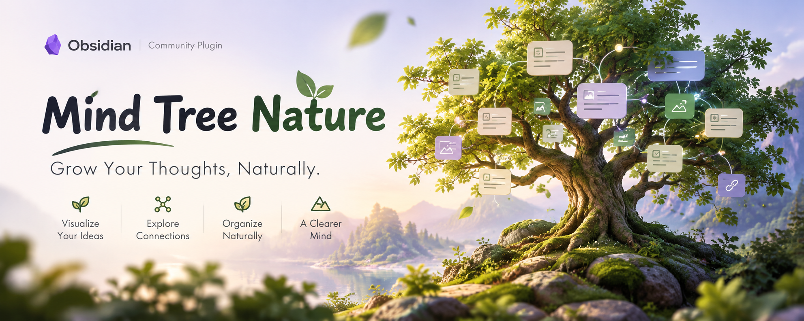

[中文](README.md) | [English](README.en.md)

# Mind Tree Nature

> Let your notes take shape the way thoughts do.

Mind Tree Nature is an **offline-first** mind map plugin for Obsidian. It uses `.mtn.md` files to organize notes, text, images, attachments, and web links in a custom view — while always keeping a plain Markdown outline that any editor or AI tool can read directly.

- **Five layouts**: balanced, right, left, tree, radial
- **Ten themes**: light/dark adaptive, with twelve branch colors cycling in order
- **Desktop and mobile**, with full touch gesture support
- **Bilingual UI**: Simplified Chinese / English, following your Obsidian language

## Design philosophy

**The map owns structure; files own content.** The plugin does not try to replace Markdown — it adds a visual organization layer on top of your existing vault. The map handles hierarchy and order; your `.md` files still hold the content itself. Disable the plugin tomorrow and your notes remain fully readable.

**One file, three readers.** The human-readable part of a `.mtn.md` is a standard unordered-list outline. An AI tool hits an explicit instruction and stops before the compressed block. The plugin itself treats the gzip + Base64 payload at the end of the file as the authoritative source. On save, the outline is regenerated from machine data, so the two can never drift apart.

**References should be stable, not fragile.** Linked files are tracked by stable resource IDs rather than brittle path strings, so references survive renames and moves. Node titles and file names stay in sync both ways by default — renaming a node renames the file.

**Offline first, your data stays yours.** No telemetry, no vault uploads, no third-party service. Web links store only a title, an address, and an optional icon; page content is never fetched in the background.

**Do one thing well: ordered trees.** The first release deliberately omits free-form canvases, flowcharts, and arbitrary graph structures — and leaves collaboration and server-side sync to whatever solution you already use.

## Installation

**Requirement**: Obsidian **1.8.7** or newer.

### Manual install (recommended)

1. Open the [Releases](https://github.com/71-MengYi/obsidian-mind-tree-natrue/releases/latest) page and download three files from the latest release's **Assets**:
   - `main.js`
   - `manifest.json`
   - `styles.css`

   > Do not download `Source code (zip)` or `Source code (tar.gz)` — those are not the plugin.

2. Create the folder `<vault>/.obsidian/plugins/mind-tree-nature/` inside your vault. The folder name must match the plugin ID exactly: `mind-tree-nature`. `.obsidian` is hidden, so enable hidden files first.
3. Put all three downloaded files in that folder, side by side.
4. Restart Obsidian, or click the refresh button under **Settings → Community plugins** to reload the plugin list.
5. Turn off **Restricted mode**, then find and enable **Mind Tree Nature** in the community plugins list.

**On mobile**: place the same three files at the same path inside your vault, using a file manager or whatever sync solution you already run.

### Install via BRAT

If you use [BRAT](https://github.com/TfTHacker/obsidian42-brat), add this repository and let BRAT handle installation and future updates:

```
71-MengYi/obsidian-mind-tree-natrue
```

### Updates

A built-in updater lives under **Settings → Mind Tree Nature → Basic settings → Plugin updates**. You can check manually or opt in to a check on startup.

An update replaces only the three program files (`main.js`, `manifest.json`, `styles.css`), verifying their size and SHA-256 before anything is swapped. It **never touches your notes or `data.json`**, and if verification fails, nothing is replaced at all.

## Quick start

### 1. Create a mind tree

Run **Mind Tree Nature: Create new mind tree** from the command palette (`Ctrl/Cmd + P`) and choose a title and folder.

The file is saved with the `.mtn.md` extension, and **opening it takes you straight into the map view**. The plugin intentionally offers no action for opening its Markdown source, because the outline is only a projection of machine data.

The first view of any new or reopened map centers the root node exactly at 100% zoom and selects it — no hunting for your place.

### 2. Grow nodes

Select a node and just use the keyboard — no button hunting:

| Keys | Action |
| --- | --- |
| `Enter` | Add a sibling below |
| `Shift + Enter` | Add a sibling above |
| `Tab` | Add a child node |
| `Shift + Tab` | Insert a parent node |
| `Space` | Edit the node title |
| `↑` `↓` | Move between sibling nodes |
| `←` `→` | Move between parent and first child |
| `Delete` / `Backspace` | Delete the selected branch |
| `Ctrl/Cmd + ↑` / `↓` | Move the node up / down among its siblings |
| `Ctrl/Cmd + C` / `X` / `V` | Copy / cut / paste a branch |
| `Ctrl/Cmd + A` | Select all visible nodes |
| `Ctrl/Cmd + Z` / `Ctrl/Cmd + Shift + Z` | Undo / redo |
| `Ctrl/Cmd + E` | Create a Markdown note for this node and link it |
| `Ctrl/Cmd + S` | Save now and update the Markdown outline |
| `Escape` | Cancel editing or dragging |

On macOS, use `Cmd` instead of `Ctrl`. The round question-mark button at the view's top-left shows the same reference.

### 3. Attach notes to the tree

- `Ctrl/Cmd + E`: create a Markdown note for an unlinked node and link it automatically. New notes can open in a right split, a new tab, the current tab, or a new window — your choice in settings.
- Node context menu → **Link existing file**: search every file in the vault except the current mind tree itself.
- **File collection**: the *File collection* option in the view's top-left menu decides what happens to unlinked files sitting next to a mind tree — *off / ask every time / add to end of first level / add to Collection*. The scan button in the bottom-left status bar re-scans the current folder for new files at any time.
- **Theme preview**: open *Theme* in the view's top-left menu and hover an option — a small preview panel appears next to it and renders that theme's colors and connections on a sample tree in real time. Moving to another option switches instantly; moving away hides it.
- You can also **drag files** in from the vault or the system, including images from the clipboard.

Once linked, node titles and file names stay in sync both ways. If you don't want that, turn off **name sync** in the first item of the context menu. Only after fully removing the link (not just name sync) do the create/link entries reappear.

### 4. Import and export

- **Import text** in the toolbar: paste list/indented text to rebuild hierarchy, or switch to the *multi-level headings* rule for nested lists. Both recognize Wiki links, Markdown note/attachment links, and HTTP/HTTPS URLs — a single link per line keeps its alias, and multiple links become separate sibling nodes in order.
- **Export** in the toolbar: export the selected branch or the whole tree as a PNG.

## File format and privacy

- Mind trees use top-level YAML `documentId`, `schemaVersion`, `layoutMode`, `recursiveScan`, `collectionMode`, `theme`, and `nodeShape` properties followed by a Markdown outline. Lossless gzip-compressed JSON is stored after the outline and an explicit instruction telling AI tools to ignore it; settings are not duplicated in that payload. A new mind tree writes no setting property: absent settings use the global defaults from Settings → Mind map at runtime, and a property is written into that file only after you choose it in the tree's own settings menu.
- The plugin does not send telemetry or upload vault content.
- Web links are stored but never fetched in the background.
- All UI text ships as Simplified Chinese and English i18n resources and follows your Obsidian language.

See [the design document](docs/requirements.md) for the product and technical baseline.

## Development

```bash
npm install
npm run check   # type check
npm test        # unit tests
npm run build   # production build, emits main.js
```

Copy `main.js`, `manifest.json`, and `styles.css` into `<vault>/.obsidian/plugins/mind-tree-nature/` to test the plugin.

## License and credits

Released under the [MIT License](LICENSE), Copyright (c) 2026 Dayiy.

Theme palettes and parts of the layout/connection behavior are adapted from the
MIT-licensed [Light Mindmap](https://github.com/ninglg/light-mindmap). See
[third-party notices](THIRD_PARTY_NOTICES.md).
